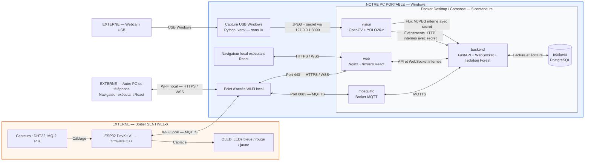

# SENTINEL-X — Spécification fonctionnelle et technique

Version 1.2 — 8 octobre 2026

## 1. Objet et portée

Réaliser un prototype local de surveillance industrielle : un ESP32 DevKit V1 collecte des mesures environnementales et pilote des alertes physiques ; un ordinateur portable analyse ces mesures et une webcam USB ; un dashboard permet de consulter les événements et de commander les actionneurs.

Cette spécification fixe les choix de réalisation issus des échanges de l'équipe. Le sujet EPSI (`sujet.pdf`, pages 2 à 8) reste la référence pédagogique. Les valeurs de configuration et critères de recette ci-dessous sont des choix du projet, sauf mention explicite du sujet. Ce document décrit le système réalisé. Les écarts avec le sujet sont listés en fin de section 2 ; les critères de recette de la section 13 restent à vérifier sur la machine finale.

Le périmètre est un boîtier, une webcam, un serveur et quelques navigateurs locaux. Le prototype fonctionne sans Internet une fois les dépendances, images Docker et modèles téléchargés. Le Wi-Fi constitue le réseau local ; il n'implique pas une connexion Internet.

## 2. Choix techniques arrêtés

| Élément | Choix |
|---|---|
| Serveur | Ordinateur portable, architecture matérielle B du sujet |
| Système cible | PC portable Windows, Docker Desktop et Docker Compose |
| Microcontrôleur | ESP32 DevKit V1 (DOIT), à la place de l'ESP8266 du sujet |
| Firmware | C++ avec Arduino IDE 2, cœur « esp32 by Espressif » 3.x, bibliothèques MQTT (Joel Gaehwiler) et ArduinoJson 7 |
| Transport IoT | MQTT sur TLS, broker Eclipse Mosquitto |
| Backend | Python, FastAPI, validation Pydantic, un seul processus applicatif |
| Temps réel navigateur | WebSocket sécurisé intégré à FastAPI |
| Frontend | React, TypeScript, Vite ; graphiques Recharts |
| Publication web | Nginx servant React et relayant API, WebSocket et vidéo via HTTPS |
| Stockage | PostgreSQL ; accès réservé au backend |
| Vision | Python, OpenCV et YOLO26-n préentraîné (`yolo26n.pt`), classe `person` uniquement |
| Anomalies | scikit-learn Isolation Forest, intégré au backend |
| Déploiement | Cinq conteneurs : `web`, `backend`, `postgres`, `mosquitto`, `vision` |

PostgreSQL est conservé pour son service dédié et sa persistance dans Compose. SQLite aurait aussi suffi à ce volume avec une seule API : la séparation des services ne rend pas PostgreSQL indispensable. Ni le navigateur ni le service vision n'accèdent directement à la base.

Les cinq services tournent dans Compose. La webcam USB est transmise directement sous Linux. Sous Windows, le lanceur démarre automatiquement une capture USB dans `.venv`, qui envoie les images au conteneur vision via un endpoint local authentifié. Aucune URL de caméra n'est à configurer. YOLO reste dans Docker ; ses poids officiels sont téléchargés et vérifiés à la construction de l'image. Un seul environnement Python local `.venv`, créé avec uv et Python 3.12.11, sert à la capture, aux outils et tests.

**Écarts assumés avec le sujet :**

| Sujet | Réalisation | Justification |
|---|---|---|
| ESP8266 | ESP32 DevKit V1 | Carte disponible dans le stock. Davantage de RAM, ce qui rend la connexion MQTT sur TLS plus confortable. Le contrat MQTT est inchangé. |
| Buzzer | LED rouge d'alarme | Aucun buzzer dans le stock. La commande `buzzer` du contrat est conservée et pilote la LED rouge ; un buzzer actif peut être ajouté sur le GPIO 33 (`HAS_BUZZER` dans `config.h`). |
| Random Forest cité en exemple | Isolation Forest | Aucune donnée de panne étiquetée : un modèle non supervisé est le seul défendable (section 9). |

## 3. Architecture et réseau



Le bloc bleu contient ce qui tourne sur notre PC Windows : cinq services dans Docker Desktop, le point d'accès Wi-Fi et le navigateur local. Le boîtier et la webcam sont des composants physiques externes. Le dashboard peut être ouvert sur le PC serveur ou sur un autre appareil du réseau : React s'exécute dans le navigateur, tandis que Nginx en distribue les fichiers.

Le portable fournit un point d'accès Wi-Fi local en 2,4 GHz, protégé par WPA2 et un mot de passe propre à l'équipe. L'ESP32 (2,4 GHz uniquement) et les postes de consultation rejoignent ce réseau. L'ESP32 fonctionne en client Wi-Fi ; il ne sert pas le dashboard.

Plan d'adressage : sous-réseau du point d'accès mobile Windows, `192.168.137.0/24` par défaut. Le serveur est `192.168.137.1` ; le boîtier et les postes de consultation reçoivent leur adresse par DHCP. L'adresse réelle est relevée avec `ipconfig` et passée à `scripts/setup.py --ip` avant le premier lancement (procédure dans le README). Un petit point d'accès dédié peut remplacer le hotspot si la carte du portable ne le supporte pas ; le reste de l'architecture reste identique.

Le navigateur ouvre `https://192.168.137.1` (ou `https://localhost` sur le serveur). Le certificat web contient cette adresse IP, `localhost` et le nom `mosquitto` dans ses SAN. Une autorité locale de confiance est installée sur les postes de démonstration. Aucun nom DNS public, CDN ou service cloud n'est requis.

| Port de l'hôte | Usage | Exposition |
|---|---|---|
| TCP 443 | Dashboard, API, WebSocket, vidéo | Réseau local de l'équipe |
| TCP 8883 | MQTT chiffré | Réseau local de l'équipe |
| TCP 22 | Administration SSH, si nécessaire | Poste d'administration autorisé uniquement |

PostgreSQL et FastAPI ne publient aucun port sur l'hôte. Les conteneurs utilisent leurs noms de services sur les réseaux Docker. Le conteneur vision transmet ses événements au backend sur le réseau Docker ; le backend relaie son flux vidéo authentifié. Les flux Wi-Fi applicatifs sont chiffrés. Le rapport explicite ces terminaisons TLS plutôt que d'affirmer un chiffrement de chaque liaison interne.

## 4. Matériel et acquisition

Matériel : ESP32 DevKit V1, DHT22 (module 3 broches, résistance de tirage intégrée), MQ-2, PIR HC-SR501, OLED I2C 0,96" (SSD1306), trois LEDs (bleue, rouge, jaune) avec résistances, webcam USB et éléments de câblage. Le boîtier est modélisé sous Fusion 360, imprimé en 3D et identifié par gravure selon le sujet.

| Composant | Broche ESP32 | Remarque |
|---|---|---|
| OLED I2C | SDA GPIO 21, SCL GPIO 22 | Adresse 0x3C |
| DHT22 | GPIO 4 | Lecture toutes les 2 s minimum |
| PIR HC-SR501 | GPIO 13 | Anti-rebond logiciel de 2 s |
| MQ-2 (sortie analogique) | GPIO 34 (ADC1) | Via un pont diviseur 10 kΩ / 10 kΩ |
| LED rouge (alarme) | GPIO 25 | Commande `buzzer` |
| LED jaune (test) | GPIO 26 | Commande `led` |
| LED bleue (système) | GPIO 27 | Automatique, non pilotable |

Les entrées analogiques de l'ESP32 acceptent 3,3 V au maximum, alors que le MQ-2 alimenté en 5 V peut sortir jusqu'à 5 V : le pont diviseur ramène ce signal dans la plage admissible. Le MQ-2 est branché sur une broche ADC1, car les broches ADC2 sont inutilisables quand le Wi-Fi est actif. Toutes les masses sont communes. Les mêmes broches sont utilisées par les sketches de test de `firmware/tests/`.

| Acquisition | Fréquence retenue | Unité / interprétation |
|---|---|---|
| Température et humidité | Toutes les 2 secondes, à confirmer avec la fiche du module | °C et % d'humidité relative |
| MQ-2 | Toutes les secondes après stabilisation | Valeur ADC brute ; aucune conversion en ppm non étalonnée |
| PIR | Lecture fréquente non bloquante ; synthèse chaque seconde | Mouvement détecté, pas preuve d'une personne immobile |
| Télémétrie globale | Un message par seconde | Dernières mesures disponibles, avec âge et validité |

Le MQ-2 expose un état `warming_up` pendant ses 2 minutes de chauffe, et le PIR pendant ses 30 secondes de stabilisation. Les mesures invalides sont `null`, jamais remplacées par zéro. Le DHT22 conserve sa dernière mesure entre deux lectures ; son âge est affichable et elle devient périmée après 6 secondes sans nouvelle lecture valide.

L'OLED affiche l'identifiant, la connexion et l'état général. La LED bleue (système) est fixe quand la chaîne complète fonctionne (Wi-Fi, MQTTS et reçus du backend), clignote lentement si le Wi-Fi fonctionne sans broker ou backend, et clignote vite sans Wi-Fi. La LED rouge (alarme) clignote pendant une commande `buzzer` et, hors alarme, s'allume pendant un mouvement PIR, même sans réseau. La LED jaune (test) s'allume pendant une commande `led`. Une LED ne prétend pas identifier seule quel service distant est en panne.

## 5. MQTT, format des données et pertes de messages

MQTT transporte des messages nommés par « topics ». Mosquitto est le broker : il distribue les messages aux clients abonnés. Le backend et l'ESP32 échangent dans les deux sens sans créer de serveur HTTP sur le microcontrôleur.

Préfixe unique : `sentinel/sentinel-x-01/`.

| Suffixe du topic | Émetteur | Usage |
|---|---|---|
| `telemetry` | ESP32 | Mesures, non retenues |
| `status` | ESP32 | État connecté / déconnecté, retenu, avec Last Will |
| `commands` | Backend | Commandes, jamais retenues |
| `acks` | ESP32 | Résultat d'une commande, non retenu |
| `receipts` | Backend | Confirmation de stockage d'une mesure, non retenue |

Les topics utilisent QoS 1 ; son support en émission et réception avec TLS est un critère de choix de la bibliothèque ESP. QoS 1 autorise les doublons et ne prouve pas le stockage en base. Un accusé applicatif de stockage assure cette dernière fonction.

Format de télémétrie :

```json
{
  "device_id": "sentinel-x-01",
  "boot_id": "7db21a09",
  "sequence": 42,
  "uptime_ms": 42000,
  "timestamp": null,
  "temperature": 24.5,
  "humidity": 48.2,
  "gas": 130,
  "presence": false,
  "sensor_age_ms": {"dht22": 1000, "mq2": 0, "pir": 0},
  "sensor_status": {"dht22": "ok", "mq2": "ok", "pir": "ok"},
  "source": "physical"
}
```

Les champs initiaux sont conservés et complétés pour gérer les pertes et doublons. `timestamp` contient l'heure UTC de capture si elle est connue, sinon `null`. Le serveur ajoute `received_at`. Le firmware mesure les intervalles avec son horloge monotone ; aucune heure UTC fictive n'est produite. L'identité unique d'une mesure est `(device_id, boot_id, sequence)`.

Le firmware conserve un tampon RAM circulaire de 60 mesures compactes, dimensionné et vérifié avec la mémoire restante sous TLS. Il retire une mesure après réception de son accusé de stockage. Le backend confirme les doublons déjà stockés sans les réinsérer. Un accusé signifie « transaction validée », pas seulement « paquet reçu ».

En cas de coupure, l'ESP poursuit ses acquisitions et tente une reconnexion avec temporisation progressive plafonnée à 10 secondes. Au retour, il transmet le tampon à débit limité, en donnant la priorité aux mesures nouvelles. Un débordement abandonne les plus anciennes mesures et incrémente un compteur de pertes visible. Le tampon ne survit pas à une coupure électrique : aucune conservation illimitée n'est promise.

Les mesures rejouées alimentent l'historique avec un indicateur de reprise. Si l'heure de capture n'est pas reconstructible à partir du même démarrage, elle reste inconnue. Elles ne déclenchent pas une alerte actuelle et ne remplacent pas les valeurs en direct.

## 6. Commandes et fonctionnement des alertes

Le dashboard commande l'alarme (type `buzzer`, qui pilote la LED rouge sur la maquette) et la LED de test jaune (type `led`) via l'API. Le backend attribue un `command_id`, publie vers MQTT et attend l'accusé de l'ESP.

```json
{
  "command_id": "c9b4d5c0-15fb-4a72-8bd2-201a987fa089",
  "target_boot_id": "7db21a09",
  "expires_at_uptime_ms": 47000,
  "type": "buzzer",
  "value": true,
  "duration_ms": 3000
}
```

L'API accepte la commande avec HTTP 202 ; l'interface affiche `pending`, puis `executed`, `rejected` ou `timeout`. Un accusé contient le même identifiant, le résultat et, si nécessaire, une raison. Les commandes sont des mises à l'état explicites, jamais des bascules ambiguës.

Le backend refuse une commande si l'appareil est hors ligne. Il estime l'échéance à partir du dernier `uptime_ms` reçu. L'ESP rejette un autre `boot_id` ou une échéance dépassée et garde les 20 derniers résultats pour répondre aux doublons sans refaire l'action. Après 5 secondes sans réponse, le backend indique `timeout` : l'exécution réelle est inconnue, pas nécessairement échouée. Aucun rejeu automatique d'une ancienne commande après reconnexion.

La LED système conserve la priorité sur les tests manuels. Une intrusion visuelle confirmée ou une anomalie environnementale persistante ouvre un événement et demande une alarme physique de 3 secondes (commande `buzzer`), limité à un déclenchement par type toutes les 30 secondes. L'acquittement marque la prise en compte humaine ; la résolution signifie que la condition a disparu. Ces états sont distincts.

Les seuils physiques éventuels sont des protections complémentaires, séparées du modèle d'anomalies. Ils ne remplacent pas l'analyse temporelle exigée par le sujet.

## 7. Backend, API et stockage

FastAPI réunit validation, client MQTT, API REST, WebSocket et inférence Isolation Forest. Il utilise un seul worker pour éviter plusieurs consommateurs MQTT et plusieurs gestionnaires d'alertes. L'inférence et les opérations bloquantes sont exécutées sans bloquer la boucle asynchrone.

Pydantic valide les types, bornes physiques documentées, taille maximale et identifiants. La validité d'une mesure et son caractère inhabituel sont deux traitements distincts. Le backend ne fait pas confiance au champ `device_id` seul : les droits MQTT et le topic identifient la source autorisée.

| Interface | Fonction |
|---|---|
| `POST /api/v1/login`, `POST /api/v1/logout` | Session opérateur |
| `GET /api/v1/status` | État des composants et fraîcheur des données |
| `GET /api/v1/measurements?seconds=60` | Dernière minute ; filtres temporels et pagination pour l'historique |
| `GET /api/v1/alerts` | Historique et alertes actives, paginés |
| `POST /api/v1/alerts` | Ingestion authentifiée des événements externes, notamment vision |
| `POST /api/v1/alerts/{id}/ack` | Acquittement opérateur |
| `POST /api/v1/commands` | Commande physique |
| `GET /api/v1/commands/{id}` | Résultat d'une commande |
| `GET /api/v1/video` | Flux MJPEG authentifié, relayé par Nginx vers vision |
| `WSS /api/v1/ws` | Mesures, états, alertes et résultats de commande |
| `GET /health/live`, `GET /health/ready` | Contrôles internes du processus et de sa disponibilité |

Les événements externes portent un `event_id` unique pour permettre des réessais sans doublons. Le service vision dispose aussi d'un point d'entrée interne de heartbeat ; il ne crée pas une nouvelle alerte à chaque image.

Tables minimales : `measurements`, `alerts`, `commands`, `device_status`. Les anomalies, détections et erreurs partagent la table `alerts` avec un type, une gravité, des dates, une source et un contenu JSON validé. Les mesures indexent appareil et date ; la clé d'identité garantit la déduplication.

Conservation : toutes les mesures, décisions d'anomalie valides et transitions utiles pendant le workshop. Aucun enregistrement vidéo continu, aucune image stockée par défaut. Les logs techniques font l'objet d'une rotation distincte ; « tout conserver » ne signifie pas enregistrer chaque image ou des logs illimités. PostgreSQL utilise un volume persistant et un export est effectué avant le rendu.

## 8. Vision locale

Un seul processus accède à la webcam USB : la capture Windows ou le service vision sous Linux. Sous Windows, la capture envoie seulement la dernière image JPEG au conteneur vision, qui applique YOLO26-n et expose le flux annoté MJPEG. Sous Linux, le conteneur capture directement les images USB. L'API reçoit les événements de présence ; elle ne transporte pas les images via WebSocket.

Paramètres initiaux : capture 640 × 480, analyse des images les plus récentes sans file d'attente croissante, modèle `yolo26n.pt`, CPU par défaut, seuil de détection 0,60. Une personne est confirmée après trois analyses positives consécutives ; l'événement est résolu après 3 secondes sans confirmation. Ces réglages sont mesurés et ajustés sur le portable réel.

Le système affiche « personne détectée ». En mode surveillance, toute personne confirmée est considérée comme une intrusion dans la zone de démonstration. Il n'effectue ni reconnaissance d'identité ni analyse d'intention. Le PIR fournit un indice de mouvement complémentaire ; il ne conditionne pas la détection visuelle.

Le sujet demande moins de 100 ms de traitement par trame. Cette exigence doit être mesurée sur les trames analysées, en indiquant matériel, résolution, latence médiane et p95. Le débit initial visé est 5 images analysées par seconde, mais cela ne prouve pas le respect des 100 ms. Si le temps de traitement est excessif, réduire la taille d'entrée, mesurer de nouveau et signaler tout écart restant au coach.

Le modèle est téléchargé avant l'essai hors ligne. Les images périmées ne sont pas présentées comme du direct. Si la webcam disparaît, le dashboard indique la panne et l'acquisition des capteurs continue.

## 9. Détection d'anomalies environnementales

Isolation Forest remplace Random Forest. Il recherche des combinaisons inhabituelles ; il ne prédit pas une date de panne et ne diagnostique pas automatiquement une fuite de gaz.

Le modèle est absent au premier lancement. L'opérateur collecte 30 secondes de mesures physiques normales à 1 Hz puis lance manuellement la calibration depuis le dashboard. L'API protégée par session et CSRF utilise uniquement les 30 dernières secondes reçues, pour un même appareil et démarrage. Elle refuse données invalides, rejouées, anciennes et interruptions.

Chaque mesure valide produit une observation température, humidité et gaz. Le PIR est exclu. Isolation Forest utilise 100 arbres, graine 42, et un seuil au quantile 99,5 % des scores de la collecte. Le score `-score_samples(X)` est calculé toutes les deux mesures : trois dépassements ouvrent l'alerte, dix observations normales la résolvent. Une donnée invalide conserve l'incident actif.

Le bouton « Réentraîner sur les 30 dernières secondes » remplace le modèle manuellement, sans bloquer l'ingestion. La sauvegarde est atomique et persistante dans un volume Docker. Une erreur conserve le précédent modèle. Aucun entraînement automatique ni artefact synthétique n'est fourni. Cette référence de 30 secondes n'a pas de validation indépendante et ne garantit pas une performance de détection ; le score n'est pas une probabilité.

## 10. Dashboard

Une page React rassemble : état général, connexion ESP, état des capteurs, broker, base, webcam et modèle ; valeurs courantes avec unités et fraîcheur ; graphiques des 60 dernières secondes ; mouvement PIR ; flux vidéo annoté ; score d'anomalie et seuil ; alertes ; commandes d'alarme et de LED de test.

Le dashboard récupère un instantané par REST à l'ouverture, puis applique les événements WebSocket. Après reconnexion il recharge la dernière minute et les alertes pour combler les événements manqués. Les courbes montrent les interruptions de données plutôt que d'inventer des valeurs ; une température réémise n'est pas présentée comme une nouvelle acquisition.

Un bandeau rouge explicite signale une panne bloquante : « E001 — sentinel-x-01 déconnecté : dernière mesure reçue il y a 12 s ». Une pastille ou un code seul ne suffit pas. L'interface distingue `normal`, `warning`, `critical`, `offline` et `initializing`, avec un libellé en plus de la couleur.

Si le backend disparaît, le navigateur détecte lui-même l'absence de heartbeat WebSocket en 5 secondes ; il n'attend pas un message d'erreur provenant du serveur arrêté. Les commandes sont désactivées tant que leur exécution n'est pas possible.

## 11. Sécurité minimale prévue

Mosquitto refuse les connexions anonymes, utilise TLS et un identifiant secret propre à l'ESP. Les ACL limitent chaque client à ses topics. Le backend possède ses propres droits. TLS ne se limite pas au chiffrement : l'ESP doit vérifier l'identité du broker. [Configuration Mosquitto](https://mosquitto.org/man/mosquitto-conf-5.html).

Le firmware vérifie le certificat du broker avec la CA locale générée par `scripts/setup.py` et embarquée dans `secrets.h` : le certificat doit être signé par cette CA **et** porter le nom `mosquitto`. La connexion se fait par IP, mais c'est le nom qui est vérifié, ce qui reste valable si l'IP du hotspot change. La clé privée de la CA ne quitte jamais le serveur ; regénérer les secrets impose de reflasher le boîtier. `setInsecure()` n'est jamais utilisé. La pile TLS de l'ESP32 (mbedTLS, `WiFiClientSecure`) ne contrôle pas les dates de validité du certificat : aucun NTP n'est donc nécessaire sur un réseau sans Internet. C'est un compromis assumé et documenté.

Un compte opérateur local suffit. Son mot de passe est haché ; la session utilise un cookie `Secure`, `HttpOnly`, `SameSite=Strict`, et expire après 8 heures. API de commande, WebSocket et vidéo exigent cette session. Les requêtes modifiant l'état vérifient aussi un jeton CSRF et l'origine. Le service vision utilise un secret distinct limité à l'ingestion et au heartbeat. Aucun JWT ou système multi-rôles n'est nécessaire au premier prototype.

Les secrets sont injectés depuis des fichiers locaux exclus de Git ; seul un exemple sans valeurs sensibles est livré. Les certificats publics ne sont pas des secrets. Le pare-feu Windows et les publications Docker sont contrôlés depuis un autre poste pour vérifier les accès réellement autorisés.

Les services tournent avec des privilèges réduits ; aucun montage du socket Docker ni mode `privileged`. Le service vision utilise un périphérique USB autorisé sous Linux ou un flux local de la webcam sous Docker Desktop. SSH, s'il est activé, utilise des clés. Les audits portent uniquement sur les cibles et fenêtres autorisées par les encadrants ; le réseau du campus hors périmètre n'est pas une cible.

## 12. Pannes, reprise et supervision

| Situation | Détection et comportement |
|---|---|
| ESP silencieux | Hors ligne après 5 secondes sans télémétrie récente ; Last Will en complément |
| Réseau coupé | Tampon ESP, LED bleue clignotante, commandes indisponibles, reconnexion automatique |
| Capteur en erreur | Valeur invalide et erreur nominative ; autres capteurs actifs |
| PostgreSQL arrêté | Pas d'accusé de stockage, pas de commande acceptée nécessitant persistance ; affichage dégradé si le backend reste joignable |
| Broker arrêté | État MQTT en erreur ; le client backend et l'ESP tentent de se reconnecter |
| Vision arrêtée | Heartbeat absent depuis 5 secondes ; télémétrie maintenue |
| Backend arrêté | Bandeau navigateur, aucune commande ; l'ESP continue son tampon |
| Redémarrage du portable | Relance du hotspot, moteur Docker et services ; données PostgreSQL conservées |

Les codes stables sont `E001` appareil hors ligne, `E002` capteur invalide, `E003` MQTT indisponible, `E004` webcam indisponible, `E005` vision indisponible, `E006` base indisponible, `E007` modèle indisponible, `E008` commande sans confirmation, `E009` perte de mesures. Chaque erreur précise sa source et son texte ; une transition d'état crée un événement plutôt qu'un événement identique par seconde.

Compose prévoit `restart: unless-stopped`, des healthchecks et des dépendances prêtes au lancement. Les clients implémentent aussi leurs propres réessais : l'ordre initial ne garantit pas la disponibilité future. Un conteneur `unhealthy` n'est pas automatiquement redémarré par cette seule politique ; les erreurs fatales doivent provoquer une sortie ou une récupération explicite. [Démarrage Compose](https://docs.docker.com/compose/how-tos/startup-order/).

Sur Windows, configurer le démarrage de Docker Desktop et du point d’accès Wi-Fi. `start.ps1` prépare l'unique venv Python 3.12.11 avec uv, puis démarre les cinq conteneurs et la capture USB automatique ; son terminal reste ouvert pendant la capture. Ctrl+C arrête la capture et les conteneurs, sans effacer les volumes. La capture utilise Media Foundation sans transformations matérielles, avec DirectShow en secours ; les appels pilotes bloqués sont interrompus dans un processus séparé. Un second lancement du même système est refusé. Les cinq services ont une politique de redémarrage Compose. Vérifier le démarrage complet sur la machine finale et désactiver la veille pendant la démonstration. Les journaux Docker sont bornés à trois fichiers de 10 Mo.

## 13. Recette : preuves attendues

Les critères suivants doivent être testés sur la machine finale ; ils ne sont pas encore vérifiés.

1. Après préparation, couper l'accès Internet : dashboard, capteurs, vision, anomalies et commandes restent utilisables sur le Wi-Fi local.
2. Observer un message de télémétrie par seconde et des graphiques de 60 secondes ; une mesure valide apparaît en moins de 2 secondes après sa réception au serveur.
3. Commander l'alarme (`buzzer`) et la LED de test (`led`) : état `pending`, accusé reçu puis résultat visible ; un doublon ne répète pas l'action.
4. Couper le Wi-Fi pendant 20 secondes : erreur affichée en 5 secondes, tampon rejoué au retour, aucune duplication PostgreSQL, aucun incident ancien présenté comme actuel.
5. Couper le Wi-Fi au-delà de la capacité du tampon : pertes explicitement comptées. Redémarrer l'ESP : nouveau `boot_id`, aucune ancienne commande appliquée.
6. Débrancher un capteur : erreur et valeur invalide visibles sans arrêt des autres mesures.
7. Présenter une personne puis quitter le champ : rectangle, événement confirmé et résolution ; relever les latences de vision et leur conformité à l'exigence du sujet.
8. Après 30 secondes de collecte physique normale, utiliser le bouton de réentraînement et vérifier la persistance du modèle au redémarrage ainsi que le refus d’une collecte incomplète.
9. Arrêter successivement vision, broker, backend et base : état dégradé observable et reprise vérifiée, sans annoncer un succès de stockage ou de commande non confirmé.
10. Redémarrer le portable : services et hotspot disponibles sans relance manuelle ; historique conservé.
11. Tester avec un client non authentifié : refus MQTT et commandes web. Avec un faux broker dont le certificat n'est pas signé par notre CA : refus par l'ESP. Capturer le trafic : mesures et commandes applicatives illisibles sur le Wi-Fi.
12. Vérifier les ports réellement exposés depuis un autre poste et l'absence de secrets dans l'archive de code.

## 14. Livrables et limites

Le prototype inclut un boîtier accessible pour maintenance, OLED visible, circulation d'air pour les capteurs et câblage propre. Livrables numériques jeudi soir, à l'heure des encadrants, dans `Workshop2026-M1-G<n>` : dossier PDF avec schémas réseau et électronique, sécurité, IA, audit et poster A3 ; présentation PPTX ; vidéo MP4 H.264 verticale 9:16 de 60 secondes maximum ; archive de code et README reproductible. Le boîtier fonctionnel est remis vendredi matin selon les modalités du campus.

La vidéo utilise le fond vert, choix retenu pour respecter la formulation la plus exigeante du sujet. La soutenance locale suit son déroulé détaillé : 1 minute d'introduction, 1 minute de vidéo, 3 minutes de démonstration, puis 5 minutes de présentation et questions. Le sujet présente quelques formulations divergentes ; les adaptations locales des encadrants priment.

La solution ne comprend pas de cloud, reconnaissance faciale, application mobile, Kubernetes, stockage vidéo continu, apprentissage automatique permanent ou diagnostic industriel certifié. L'objectif de recette est un système intégré, observable, reproductible et capable de reprendre après les pannes prévues.

## 15. Références

- Sujet EPSI fourni : `sujet.pdf`, notamment pages 2 à 8, source des obligations pédagogiques.
- [SQLite : domaines d'utilisation](https://www.sqlite.org/whentouse.html), pour distinguer capacité réelle et préférence architecturale.
- [Ultralytics YOLO26](https://docs.ultralytics.com/models/yolo26), modèle nano de détection retenu (`yolo26n.pt`).
- Références Mosquitto, Espressif ESP32, scikit-learn et Docker citées dans les sections correspondantes, consultées le 5 octobre 2026.

Les versions sont figées dans `requirements.txt`, `backend/requirements.lock.txt`, `vision/requirements.txt`, `frontend/pnpm-lock.yaml` et `vision/model/manifest.json` (poids YOLO et empreinte SHA-256) ; les versions du firmware validées par compilation sont dans `firmware/sentinel_x/README.md`. La présente spécification n'annonce aucune performance non mesurée.
